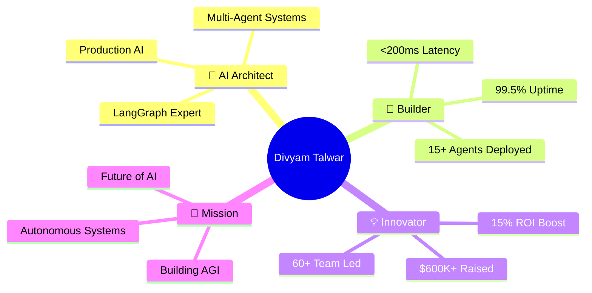

# <div align="center">⚡ **DIVYAM TALWAR** ⚡</div>

<div align="center">
  
</div>

<div align="center">
  
[](https://git.io/typing-svg)


</div>

<div align="center">
  
  [](https://github.com/DivyamTalwar)
  [](https://github.com/DivyamTalwar)
  [](https://linkedin.com/in/divyam-talwar)
  [](mailto:divyamtalwar.ai@gmail.com)
  
</div>

---

<div align="center">
  
## 🎨 **WHO AM I?**

<table>
<tr>
<td>



</td>
</tr>
</table>

</div>

---

## 🏆 **FLAGSHIP PROJECTS**

<div align="center">
  
</div>

<table>
<tr>
<td width="33%">

<div align="center">
  
### 🤖 **[NextGen-Trader](https://github.com/DivyamTalwar/NextGen-Trader)**
*Autonomous AI Hedge Fund*

<a href="https://github.com/DivyamTalwar/NextGen-Trader">
  
</a>


| Metric | Impact |
|--------|--------|
| **Agents** | `15 AIs` |
| **ROI** | `+15%` |
| **Speed** | `5 min` |


</div>

</td>
<td width="33%">

<div align="center">
  
### 💼 **[RecruitX](https://github.com/DivyamTalwar/RecruitX)**
*AI Talent Intelligence*

<a href="https://github.com/DivyamTalwar/RecruitX">
  
</a>


| Metric | Impact |
|--------|--------|
| **Match** | `+50%` |
| **Time** | `-60%` |
| **XAI** | `100%` |


</div>

</td>
<td width="33%">

<div align="center">
  
### 📱 **[ReceiptMatch.AI](https://github.com/DivyamTalwar/ReceiptMatch.AI)**
*Intelligent Receipt Processing*

<a href="https://github.com/DivyamTalwar/ReceiptMatch.AI">
  
</a>


| Metric | Impact |
|--------|--------|
| **OCR** | `98%` |
| **Speed** | `<3s` |
| **Scale** | `10K+` |


</div>

</td>
</tr>
</table>

---

## 🛠️ **TECHNOLOGY ARSENAL**

<div align="center">
  
  <h3>🎯 Complete Tech Stack Mastery</h3>
</div>

### 🤖 **GENERATIVE AI & LLM ECOSYSTEM**

<table align="center">
<tr>
<td align="center" width="33%">

#### 🧠 **Agentic Frameworks**


</td>
<td align="center" width="33%">

#### 🎨 **LLM Platforms**


</td>
<td align="center" width="33%">

#### 🔧 **RAG & Observability**


</td>
</tr>
</table>

### 🧬 **DEEP LEARNING & ML FRAMEWORKS**

<div align="center">


</div>

### 💾 **VECTOR DATABASES & DATA INFRASTRUCTURE**

<div align="center">


</div>

### ⚡ **BACKEND & DEPLOYMENT**

<div align="center">


</div>

### 🔬 **FINE-TUNING & OPTIMIZATION**

<div align="center">


</div>

### 📊 **MLOps & MONITORING**

<div align="center">


</div>

---

## 📊 **GITHUB PERFORMANCE ANALYTICS**

<div align="center">
  
</div>

<p align="center">
  
  
</p>

<p align="center">
  
  
</p>

<div align="center">
  
</div>

---

## 🚀 **CURRENT INITIATIVES**

<div align="center">
  
</div>

<table align="center">
<tr>
<td width="33%" align="center">

### 🧠 **Autonomous Trading**


```yaml
Agents: 15 Specialized AIs
ROI: +15% Risk-Adjusted
Stack: [LangGraph, PyTorch]
Latency: <200ms
```

</td>
<td width="33%" align="center">

### 🎯 **Enterprise RAG**


```yaml
Users: 1000+ Active
Accuracy: 95%
Stack: [LangChain, Pinecone]
Response: <500ms
```

</td>
<td width="33%" align="center">

### 💼 **AI Recruiter**


```yaml
Matching: +50% Quality
Time: -60% Screening
Stack: [XAI, FAISS]
Scale: Enterprise-Ready
```

</td>
</tr>
</table>

---

## 💬 **LET'S BUILD THE FUTURE TOGETHER**

<div align="center">
  
### 🌟 **Connect & Collaborate**


</div>

<div align="center">

<table>
<tr>
<td align="center">


### 📧 **Email**
[divyamtalwar.ai@gmail.com](mailto:divyamtalwar.ai@gmail.com)

</td>
<td align="center">


### 💼 **LinkedIn**
[/in/divyam-talwar](https://linkedin.com/in/divyam-talwar)

</td>
<td align="center">


### 💬 **Discord**
[theDream4756](https://discord.gg/theDream4756)

</td>
<td align="center">


### 🐙 **GitHub**
[@DivyamTalwar](https://github.com/DivyamTalwar)

</td>
</tr>
</table>

</div>

<div align="center">

### 🎯 **OPEN FOR OPPORTUNITIES**

<table>
<tr>
<td>

```python
interests = {
    "🤖": "Multi-Agent Systems",
    "💰": "Financial AI & Trading",
    "🚀": "Production LLM Deployments", 
    "🧠": "Autonomous Intelligence",
    "📊": "Explainable AI Systems",
    "⚡": "High-Performance Backends"
}

availability = "🟢 ACTIVELY SEEKING NEW CHALLENGES"
```

</td>
</tr>
</table>

</div>

---

<div align="center">

### 💭 **Philosophy**


### 🏆 **Achievement Highlight**

<table>
<tr>
<td align="center">

**🎯 Led 60+ Person Team** | **💰 $600K+ Funding Raised** | **🚀 12+ Startups Launched**

</td>
</tr>
</table>


### ⚡ **Building AGI, One Agent at a Time** ⚡

</div>

---

<div align="center">
  
</div>
