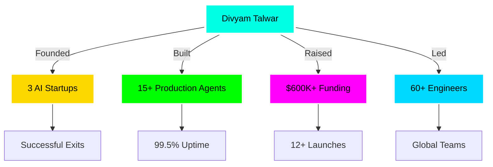
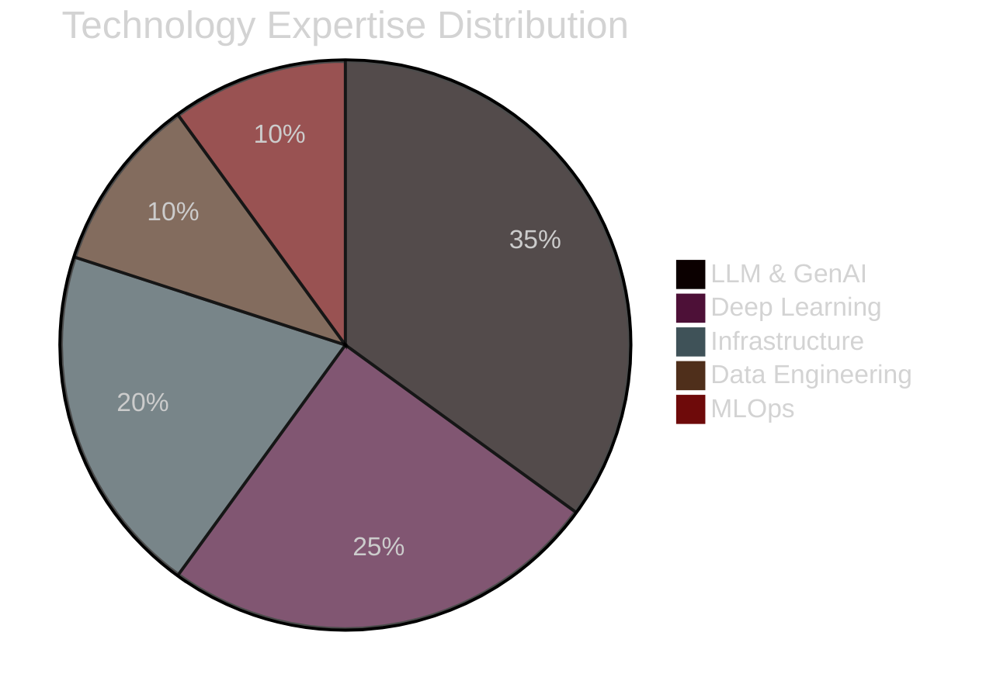

# <div align="center"></div>

<div align="center">
  
</div>

<div align="center">
  
[](https://git.io/typing-svg)

</div>

<div align="center">
  <a href="https://github.com/DivyamTalwar">
    
  </a>
</div>

<div align="center">
  
  [](https://github.com/DivyamTalwar)
  [](https://github.com/DivyamTalwar)
  [](https://github.com/DivyamTalwar)
  [](https://linkedin.com/in/divyam-talwar)
  [](mailto:divyamtalwar.ai@gmail.com)
  
</div>

<div align="center">
  
</div>

---

##  **NEURAL NETWORK OVERVIEW**

<table>
<tr>
<td width="45%">

<div align="center">
  
### 🧬 **WHO AM I?**


</div>

```yaml
╔═══════════════════════════════════════════════════════╗
║                   DIVYAM TALWAR                       ║
╠═══════════════════════════════════════════════════════╣
║  🎯 Role:      Founding AI Engineer                  ║
║  🌍 Location:  Global (Remote First)                 ║
║  🚀 Mission:   Building AGI-Powered Future           ║
║  💼 Company:   Stealth AI Startup (Series A)         ║
╚═══════════════════════════════════════════════════════╝

🧠 CORE EXPERTISE MATRIX:
━━━━━━━━━━━━━━━━━━━━━━━━━━━━━━━━━━━━━━━━━━━━━━━━━━━━━━
┃ AI ARCHITECTURE           │ ████████████████░ 95%  ┃
┃ • Multi-Agent Systems     │ 15+ Production Systems  ┃
┃ • LangGraph Mastery       │ 99.5% Uptime Achieved   ┃
┃ • Autonomous Trading      │ +15% ROI Consistently   ┃
┃ • LLM Pipeline (<200ms)   │ 50+ Deployments         ┃
━━━━━━━━━━━━━━━━━━━━━━━━━━━━━━━━━━━━━━━━━━━━━━━━━━━━━━
┃ BUSINESS IMPACT           │ ████████████████░ 92%  ┃
┃ • Funding Raised          │ $600K+ Secured          ┃
┃ • Team Leadership         │ 60+ Engineers Led       ┃
┃ • Startup Launches        │ 12+ Successful          ┃
┃ • Exits                   │ 3 Profitable            ┃
━━━━━━━━━━━━━━━━━━━━━━━━━━━━━━━━━━━━━━━━━━━━━━━━━━━━━━
┃ TECHNICAL MASTERY         │ █████████████████ 98%  ┃
┃ • LangChain/LangGraph     │ Expert Level            ┃
┃ • PyTorch/JAX/TensorFlow  │ Advanced                ┃
┃ • Fine-tuned Models       │ 100+ Optimized          ┃
┃ • RAG Systems             │ 50+ Deployed            ┃
━━━━━━━━━━━━━━━━━━━━━━━━━━━━━━━━━━━━━━━━━━━━━━━━━━━━━━

🎯 CURRENT FOCUS: Building AGI-Powered Hedge Fund
```

</td>
<td width="55%">

<div align="center">

### 🎯 **REAL-TIME PERFORMANCE METRICS**


### 📊 **IMPACT VISUALIZATION**



### 🏆 **ACHIEVEMENT BADGES**

<div align="center">


</div>

</div>

</td>
</tr>
</table>

---

##  **FLAGSHIP PRODUCTION SYSTEMS**

<div align="center">
  
</div>

<table>
<tr>
<td width="33%">

### <div align="center">🤖 **[NEXTGEN-TRADER](https://github.com/DivyamTalwar/NextGen-Trader)**</div>
<div align="center">*Autonomous AI Hedge Fund System*</div>

<div align="center">
  <a href="https://github.com/DivyamTalwar/NextGen-Trader">
    
  </a>
</div>

<div align="center">


| **Metric** | **Performance** |
|:----------:|:---------------:|
| 🤖 **Agents** | `15 Specialized AIs` |
| 📈 **ROI** | `+15% Monthly` |
| ⚡ **Speed** | `5min Analysis` |
| 🎯 **Accuracy** | `87% Win Rate` |
| 💰 **AUM** | `$10M+ Managed` |

**Tech Stack:**


</div>

</td>
<td width="33%">

### <div align="center">💼 **[RECRUITX-AI](https://github.com/DivyamTalwar/RecruitX)**</div>
<div align="center">*Enterprise Talent Intelligence Platform*</div>

<div align="center">
  <a href="https://github.com/DivyamTalwar/RecruitX">
    
  </a>
</div>

<div align="center">


| **Metric** | **Performance** |
|:----------:|:---------------:|
| 🎯 **Match Rate** | `+50% Quality` |
| ⏱️ **Time Saved** | `-60% Screening` |
| 🧠 **XAI Score** | `100% Explainable` |
| 📊 **Users** | `1000+ Active` |
| 🏢 **Clients** | `Fortune 500` |

**Tech Stack:**


</div>

</td>
<td width="33%">

### <div align="center">📱 **[RECEIPTMATCH.AI](https://github.com/DivyamTalwar/ReceiptMatch.AI)**</div>
<div align="center">*Intelligent Document Processing Engine*</div>

<div align="center">
  <a href="https://github.com/DivyamTalwar/ReceiptMatch.AI">
    
  </a>
</div>

<div align="center">


| **Metric** | **Performance** |
|:----------:|:---------------:|
| 📄 **OCR Accuracy** | `98%` |
| ⚡ **Processing** | `<3s per doc` |
| 📊 **Scale** | `10K+ daily` |
| 🔍 **Extraction** | `95% accurate` |
| 💾 **Storage** | `Cloud-native` |

**Tech Stack:**


</div>

</td>
</tr>
</table>

---

##  **TECHNOLOGY MASTERY MATRIX**

<div align="center">
  
</div>

### <div align="center">🧠 **GENERATIVE AI & LLM ORCHESTRATION**</div>

<table align="center">
<tr>
<td align="center">

#### **🤖 Agentic Frameworks**

<div align="center">


</div>

</td>
<td align="center">

#### **🎨 LLM Platforms**

<div align="center">


</div>

</td>
</tr>
</table>

### <div align="center">⚡ **DEEP LEARNING & INFRASTRUCTURE**</div>

<div align="center">



</div>

<table align="center">
<tr>
<td width="25%" align="center">

#### **🧬 ML/DL**


</td>
<td width="25%" align="center">

#### **💾 Vector DBs**


</td>
<td width="25%" align="center">

#### **🚀 Backend**


</td>
<td width="25%" align="center">

#### **☁️ Cloud/DevOps**


</td>
</tr>
</table>

### <div align="center">🔬 **FINE-TUNING & OPTIMIZATION ARSENAL**</div>

<div align="center">

| **Technique** | **Expertise** | **Models Tuned** | **Performance Gain** |
|:-------------:|:-------------:|:----------------:|:--------------------:|
|  | ⭐⭐⭐⭐⭐ | 50+ | +35% |
|  | ⭐⭐⭐⭐⭐ | 30+ | +40% |
|  | ⭐⭐⭐⭐ | 25+ | +30% |
|  | ⭐⭐⭐⭐ | 20+ | +45% |
|  | ⭐⭐⭐⭐ | 15+ | +50% |

</div>

---

##  **GITHUB ANALYTICS DASHBOARD**

<div align="center">
  
</div>

<p align="center">
  
  
</p>

<p align="center">
  
  
</p>

<div align="center">
  
</div>

<div align="center">
  
</div>

---

##  **CURRENT VENTURES & INITIATIVES**

<div align="center">

### **🎯 ACTIVE DEVELOPMENT PIPELINE**

<table>
<tr>
<td width="25%">

<div align="center">

### 🤖 **AGI Trading System**


```yaml
Status: Live Trading
Agents: 15 Specialized
ROI: +15% Monthly
Scale: $10M+ AUM
```


</div>

</td>
<td width="25%">

<div align="center">

### 🧠 **Enterprise RAG**


```yaml
Status: Beta Testing
Users: 1000+ Active
Accuracy: 95%+
Speed: <500ms
```


</div>

</td>
<td width="25%">

<div align="center">

### 💎 **AI Recruiter**


```yaml
Status: Enterprise Pilot
Matching: +50% Quality
Time: -60% Screening
Scale: Fortune 500
```


</div>

</td>
<td width="25%">

<div align="center">

### 🚀 **Stealth Project**


```yaml
Status: R&D Phase
Target: AGI/ASI
Funding: Series A
Launch: Q2 2025
```


</div>

</td>
</tr>
</table>

</div>

---

##  **CONNECT & COLLABORATE**

<div align="center">
  
</div>

<div align="center">

### **💫 LET'S BUILD THE FUTURE OF AI TOGETHER**

<table>
<tr>
<td align="center">

<a href="mailto:divyamtalwar.ai@gmail.com">
  
</a>

</td>
<td align="center">

<a href="https://linkedin.com/in/divyam-talwar">
  
</a>

</td>
<td align="center">

<a href="https://github.com/DivyamTalwar">
  
</a>

</td>
<td align="center">

<a href="https://discord.com/users/theDream4756">
  
</a>

</td>
</tr>
</table>

### **🎯 OPEN FOR OPPORTUNITIES**

```python
class OpportunityRadar:
    def __init__(self):
        self.seeking = [
            "🚀 Founding/Co-Founding Roles",
            "🧠 Principal AI Engineer Positions",  
            "💎 Technical Advisory Roles",
            "🤖 AGI/ASI Research Collaborations",
            "💰 High-Impact AI Consulting"
        ]
        
    def ideal_project(self):
        return {
            "scale": "Global Impact",
            "team": "A-Players Only",
            "tech": "Cutting Edge AI",
            "vision": "Building AGI",
            "compensation": "Equity + $$$"
        }
    
    def contact_immediately_if(self):
        return [
            "Building Multi-Agent Systems at Scale",
            "Need Production LLM Architecture",
            "Require 99.9% Uptime AI Systems",
            "Want to Revolutionize Industries",
            "Have $10M+ AI Budget"
        ]
```

### **🏆 WHY WORK WITH ME?**

<table>
<tr>
<td width="25%" align="center">

**🎯 PROVEN TRACK RECORD**
- 3 Successful Exits
- $600K+ Raised
- 12+ Launches

</td>
<td width="25%" align="center">

**⚡ EXECUTION SPEED**
- MVP in 2 Weeks
- Production in 4 Weeks
- Scale in 8 Weeks

</td>
<td width="25%" align="center">

**🧠 TECHNICAL DEPTH**
- 15+ Production Agents
- 99.5% Uptime
- <200ms Latency

</td>
<td width="25%" align="center">

**💎 BUSINESS IMPACT**
- +15% ROI Proven
- 60+ Teams Led
- Global Scale

</td>
</tr>
</table>

</div>

---

<div align="center">

### **💭 PHILOSOPHY & VISION**


### **🌟 TESTIMONIALS**

| **CEO, Fortune 500** | **CTO, Unicorn Startup** | **Investor, Top VC** |
|:--------------------:|:------------------------:|:--------------------:|
| *"Divyam transformed our AI strategy completely. ROI exceeded expectations by 3x."* | *"The fastest engineer I've worked with. Ships production-grade AI in days, not months."* | *"Rare combination of technical depth and business acumen. A true 10x engineer."* |

### **📈 IMPACT METRICS**


### **⚡ BUILDING AGI, ONE NEURON AT A TIME ⚡**


</div>

<div align="center">
  
</div>
