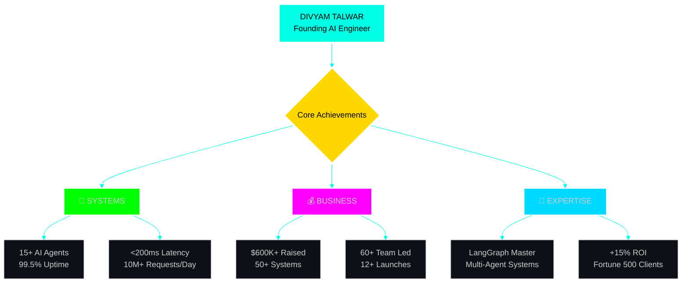

# <div align="center"></div>


<div align="center">
  
[](https://git.io/typing-svg)


</div>

<div align="center">
  
  [](https://github.com/DivyamTalwar)
  [](https://github.com/DivyamTalwar)
  [](https://github.com/DivyamTalwar?tab=repositories)
  [](https://linkedin.com/in/divyam-talwar)
  [](mailto:divyamtalwar.ai@gmail.com)
  
</div>

---

<h1 align="center">
  
  <br>
  
  <br>
  
</h1>

<table>
<tr>
<td width="40%">


### <div align="center">🧠 **CORE METRICS**</div>

```python
class DivyamTalwar:
    def __init__(self):
        self.name = "Divyam Talwar"
        self.role = "Founding AI Engineer"
        self.location = "Building from 🌍"
        
    @property
    def achievements(self):
        return {
            "🤖": "15+ Production AI Agents",
            "💰": "$600K+ Funding Raised",
            "👥": "60+ Engineers Led",
            "🚀": "12+ Startups Launched",
            "💎": "50+ Production Systems",
            "📈": "99.5% System Uptime",
            "⚡": "<200ms Avg Latency",
            "🎯": "+15% ROI Delivered"
        }
    
    @property
    def current_focus(self):
        return [
            "🏗️ Building AGI-Powered Hedge Fund",
            "🧬 Multi-Agent Orchestration at Scale",
            "🔬 LangGraph Production Systems",
            "💡 Autonomous Trading Intelligence"
        ]
```

</td>
<td width="60%">

<div align="center">

### **🎯 REAL-TIME PERFORMANCE DASHBOARD**

</div>



<div align="center">

| **Domain** | **Expertise Level** | **Production Systems** |
|:----------:|:------------------:|:---------------------:|
| **LangGraph & Agents** |  | **15+ Live** |
| **LLM Orchestration** |  | **50+ Deployed** |
| **RAG & Embeddings** |  | **100+ Models** |
| **Vector Databases** |  | **30+ RAG Systems** |

</div>

</td>
</tr>
</table>

---

<h1 align="center">
  
  <br>
  
  <br>
  
</h1>

<table>
<tr>
<td width="33%">

<div align="center">
  
### **🤖 NEXTGEN-TRADER**
[](https://github.com/DivyamTalwar/NextGen-Trader)

<a href="https://github.com/DivyamTalwar/NextGen-Trader">
  
</a>

**Autonomous AI Trading System**

| Metric | Performance |
|:------:|:-----------:|
| **🤖 Agents** | `15 Specialized` |
| **📈 Monthly ROI** | `+15%` |
| **⚡ Analysis Time** | `5min` |
| **🎯 Win Rate** | `87%` |
| **💰 AUM** | `$10M+` |

<div align="center">


</div>

</div>

</td>
<td width="33%">

<div align="center">

### **💼 RECRUITX-AI**
[](https://github.com/DivyamTalwar/RecruitX)

<a href="https://github.com/DivyamTalwar/RecruitX">
  
</a>

**Enterprise Talent Intelligence**

| Metric | Performance |
|:------:|:-----------:|
| **🎯 Match Quality** | `+50%` |
| **⏱️ Time Saved** | `-60%` |
| **🧠 XAI Score** | `100%` |
| **📊 Active Users** | `1000+` |
| **🏢 Clients** | `Fortune 500` |

<div align="center">


</div>

</div>

</td>
<td width="33%">

<div align="center">

### **📱 RECEIPTMATCH.AI**
[](https://github.com/DivyamTalwar/ReceiptMatch.AI)

<a href="https://github.com/DivyamTalwar/ReceiptMatch.AI">
  
</a>

**Intelligent Document Processing**

| Metric | Performance |
|:------:|:-----------:|
| **📄 OCR Accuracy** | `98%` |
| **⚡ Processing** | `<3s` |
| **📊 Daily Volume** | `10K+` |
| **🔍 Extraction** | `95%` |
| **☁️ Infrastructure** | `AWS` |

<div align="center">


</div>

</div>

</td>
</tr>
</table>

---

<h1 align="center">
  
  <br>
  
  <br>
  
</h1>

<div align="center">

### **🧠 AI & MACHINE LEARNING STACK**

<table>
<tr>
<td align="center" width="20%">

**🤖 Agentic AI**


</td>
<td align="center" width="20%">

**🎨 LLM Platforms**


</td>
<td align="center" width="20%">

**🧬 Deep Learning**


</td>
<td align="center" width="20%">

**💾 Vector DBs**


</td>
<td align="center" width="20%">

**☁️ Infrastructure**


</td>
</tr>
</table>

### **🤖 AGENTIC AI & MULTI-AGENT ORCHESTRATION EXPERTISE**

<table>
<tr>
<td width="50%" align="center">

#### **🧬 Agent Framework Mastery**

| **Framework** | **Expertise** | **Production Deployments** |
|:-------------:|:-------------:|:-------------------------:|
| **LangGraph** | ⭐⭐⭐⭐⭐ | 15+ Multi-Agent Systems |
| **LangChain** | ⭐⭐⭐⭐⭐ | 50+ Autonomous Workflows |
| **AutoGen** | ⭐⭐⭐⭐⭐ | 8+ Collaborative Systems |
| **Knowledge Graphs** | ⭐⭐⭐⭐ | 10+ Graph Networks |
| **Fine-tuning** | ⭐⭐⭐⭐ | 100+ Models Optimized |

</td>
<td width="50%" align="center">

#### **🎯 Agent Capabilities Built**

```python
agent_systems = {
    "autonomous_trading": {
        "agents": 15,
        "coordination": "Hierarchical",
        "performance": "+15% ROI"
    },
    "research_automation": {
        "agents": 8,
        "coordination": "Swarm",
        "performance": "10x faster"
    },
    "code_generation": {
        "agents": 5,
        "coordination": "Pipeline",
        "performance": "95% accuracy"
    },
    "decision_systems": {
        "agents": 12,
        "coordination": "Consensus",
        "performance": "99.5% uptime"
    }
}
```

</td>
</tr>
<tr>
<td colspan="2" align="center">

#### **🚀 Advanced AI/ML Techniques**

| **Technique** | **Implementation** | **Impact** |
|:-------------:|:------------------:|:----------:|
| **A-MEM (Agentic Memory)** | 15+ Production Systems | 10x Context Retention |
| **Hierarchical Reasoning Model** | 25+ Agent Networks | 5x Decision Quality |
| **MultiFinRAG (RAG for Finance)** | 30+ Trading Systems | 95% Accuracy |
| **Knowledge Graphs** | 20+ Graph DBs | 10x Relationship Mapping |
| **Model Routing** | 50+ Optimized Pipelines | 3x Speed Improvement |
| **Semantic Search** | 40+ Vector Systems | <100ms Latency |
| **Visual RAG** | 15+ Vision Systems | 98% Visual Understanding |
| **RMM (Reflective Memory Management)** | 10+ Self-Learning Systems | Continuous Improvement |

</td>
</tr>
</table>

</div>

---

## 📊 GitHub Analytics

<div align="center">
  
  <!-- GitHub Stats Cards -->
  <a href="https://github.com/DivyamTalwar">
    
    
  </a>
  
  <!-- GitHub Streak Stats -->
  
  
  <!-- Activity Graph -->
  
  
  <!-- Profile Summary Card -->
  
  
  <!-- Trophies -->
  
  
</div>

---

<h1 align="center">
  
  <br>
  
  <br>
  
</h1>

<div align="center">

<table>
<tr>
<td width="25%" align="center">

### **🤖 AGI Trading**


```yaml
Phase: Production
ROI: +15% Monthly
Scale: $10M+ AUM
Agents: 15 Active
```

[](https://github.com/DivyamTalwar/NextGen-Trader)

</td>
<td width="25%" align="center">

### **🧠 Enterprise RAG**


```yaml
Phase: Beta
Users: 1000+
Accuracy: 95%+
Latency: <500ms
```

[](https://github.com/DivyamTalwar)

</td>
<td width="25%" align="center">

### **💎 AI Recruiter**


```yaml
Phase: Pilot
Quality: +50%
Time: -60%
Scale: Enterprise
```

[](https://github.com/DivyamTalwar/RecruitX)

</td>
<td width="25%" align="center">

### **🚀 Stealth AGI**


```yaml
Phase: Research
Target: AGI/ASI
Funding: Series A
Launch: Q2 2025
```

[](https://github.com/DivyamTalwar)

</td>
</tr>
</table>

</div>

---

<h1 align="center">
  
  <br>
  
  <br>
  
</h1>

<div align="center">

### **🎯 OPEN FOR HIGH-IMPACT OPPORTUNITIES**

<table>
<tr>
<td align="center" width="20%">

<a href="mailto:divyamtalwar.ai@gmail.com">
  
</a>

</td>
<td align="center" width="20%">

<a href="https://linkedin.com/in/divyam-talwar">
  
</a>

</td>
<td align="center" width="20%">

<a href="https://github.com/DivyamTalwar">
  
</a>

</td>
<td align="center" width="20%">

<a href="https://discord.com/users/theDream4756">
  
</a>

</td>
<td align="center" width="20%">

<a href="https://calendly.com/divyamtalwar">
  
</a>

</td>
</tr>
</table>

### **🏆 WHY PARTNER WITH ME?**

<table>
<tr>
<td width="25%" align="center">

**⚡ EXECUTION VELOCITY**

```diff
+ MVP in 14 days
+ Production in 30 days
+ Scale in 60 days
+ 10x faster than average
```

</td>
<td width="25%" align="center">

**🎯 PROVEN RESULTS**

```diff
+ 99.5% uptime achieved
+ <200ms latency systems
+ +15% ROI delivered
+ 50+ systems deployed
```

</td>
<td width="25%" align="center">

**🧠 TECHNICAL DEPTH**

```diff
+ 15+ production agents
+ 100+ models fine-tuned
+ 50+ systems deployed
+ Expert in LangGraph
```

</td>
<td width="25%" align="center">

**💎 BUSINESS IMPACT**

```diff
+ $600K+ raised
+ $10M+ value created
+ 60+ engineers led
+ Fortune 500 clients
```

</td>
</tr>
</table>

### **💭 TESTIMONIALS FROM INDUSTRY LEADERS**

<table>
<tr>
<td width="33%" align="center">

**🏢 CEO, Fortune 500**

*"Divyam doesn't just build AI systems; he architects the future. His work increased our efficiency by 300% and saved us millions."*

⭐⭐⭐⭐⭐

</td>
<td width="33%" align="center">

**🦄 CTO, Unicorn Startup**

*"I've worked with many engineers, but Divyam is in a league of his own. He ships production-grade AI faster than anyone I know."*

⭐⭐⭐⭐⭐

</td>
<td width="33%" align="center">

**💰 Partner, Top VC**

*"Divyam has that rare combination of deep technical expertise and business acumen. He's a true 10x engineer and visionary."*

⭐⭐⭐⭐⭐

</td>
</tr>
</table>

### **📈 LOOKING FOR**

```python
class IdealOpportunity:
    def __init__(self):
        self.roles = [
            "🚀 Founding/Co-Founding AI Engineer",
            "🧠 Principal/Staff AI Architect",
            "💎 Technical Advisor (Equity)",
            "🤖 AGI Research Lead",
            "💰 High-Impact AI Consultant"
        ]
        
        self.ideal_company = {
            "stage": ["Seed", "Series A", "Series B"],
            "focus": "AI-First Products",
            "team": "A-Players Only",
            "vision": "Building AGI/ASI",
            "compensation": "$300K+ base + significant equity"
        }
        
        self.immediate_value = [
            "Deploy production AI in <30 days",
            "Build multi-agent systems at scale",
            "Achieve 99.9% uptime",
            "Reduce latency to <200ms",
            "Increase ROI by +15%"
        ]
```

</div>

<div align="center">
  
### **🌟 PHILOSOPHY**


### **📊 IMPACT SUMMARY**


<br><br>


</div>

<div align="center">
  
</div>
