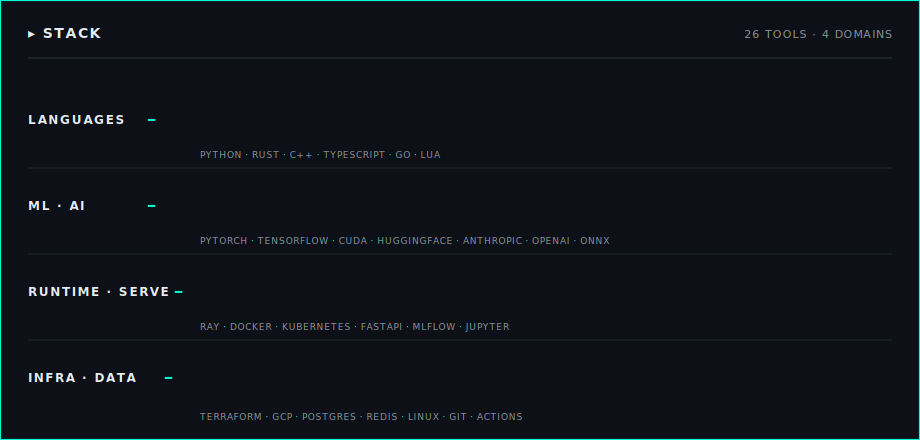
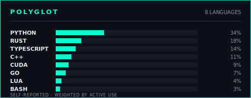

<!--
  divyamtalwar / divyamtalwar
  brutalist-minimal · pure black · single accent #FF8C42
  text speaks for itself.
-->

<picture>
  <source media="(prefers-color-scheme: dark)" srcset="assets/hero-v2.svg">
  
</picture>

<p align="left">
  
</p>

---

## ▸&nbsp;&nbsp;FEATURED&nbsp;SYSTEMS

<br/>

## **▸ FLAGSHIP · 01** &nbsp;━━━━&nbsp; **MEMORY SUBSTRATE**

<p>
  
  
  
  
</p>

<a href="https://github.com/DivyamTalwar/JITMIND">
  
</a>

**Most agent memory rots. JITMIND doesn't let it.**

&nbsp;&nbsp;▸ &nbsp; Every fact carries a **time signature** — bi-temporal validity with 5 lifecycle axes<br/>
&nbsp;&nbsp;▸ &nbsp; Every retrieval is **provenance-aware** — BM25 + dense + graph fusion with personalized PageRank<br/>
&nbsp;&nbsp;▸ &nbsp; Every contradiction triggers a **self-edit** — ADD / UPDATE / DELETE / NOOP lifecycle ops

Built under a `plan → search → integrate → reflect` loop. Designed for assistants that stay correct across **thousands of sessions** and **weeks of drift**.

<br/>

## **▸ FLAGSHIP · 02** &nbsp;━━━━&nbsp; **STRUCTURE RUNTIME**

<p>
  
  
  
  
  
</p>

<a href="https://github.com/DivyamTalwar/STRUCTORIUM">
  
</a>

**Most tools find issues. Structorium remembers them.**

&nbsp;&nbsp;▸ &nbsp; Every scan **builds on the last** — persistent quality score with anti-gaming mechanics<br/>
&nbsp;&nbsp;▸ &nbsp; Every fix is **measured** — delta tracking across **30+ detectors**, **28 languages**<br/>
&nbsp;&nbsp;▸ &nbsp; Every regression is **caught at the gate** — new-code gate blocks PRs that lower the bar

An AI context layer gives reviewers exactly what they need. This isn't a linter — it's the **operating system for codebase quality**, built from the ground up for AI coding agents.

<br/>

## **▸ FLAGSHIP · 03** &nbsp;━━━━&nbsp; **COMPUTE RUNTIME**

<p>
  
  
  
  
  
</p>

<a href="https://github.com/DivyamTalwar/MoE-Xtend">
  
</a>

**Long context isn't a config flag. It's a math problem.**

&nbsp;&nbsp;▸ &nbsp; **Sparse MoE** — top-K expert routing keeps compute sparse while capacity stays dense<br/>
&nbsp;&nbsp;▸ &nbsp; **RoPE+YaRN scaling** — holds at **1M tokens** without positional collapse<br/>
&nbsp;&nbsp;▸ &nbsp; **Deterministic decode** — same input, same output, every time<br/>
&nbsp;&nbsp;▸ &nbsp; **KV-cache discipline** — doesn't melt under load

Built for the moments when `"just increase context_length"` stops working. The architecture **respects the math**.

---

## ▸&nbsp;&nbsp;RESEARCH&nbsp;STACK

> **FOUR** &nbsp;━&nbsp; experimental systems pushing on the next set of primitives. Hand-built. Single-author. Public.

<br/>

<table border="0" cellspacing="0" cellpadding="8" align="center">
<tr>
<td><a href="https://github.com/DivyamTalwar/SYNAPTIC"></a></td>
<td><a href="https://github.com/DivyamTalwar/BLUEPRINT"></a></td>
</tr>
<tr>
<td><a href="https://github.com/DivyamTalwar/INFINICHUNK"></a></td>
<td><a href="https://github.com/DivyamTalwar/AIME"></a></td>
</tr>
</table>

---

## ▸&nbsp;&nbsp;MORE&nbsp;SYSTEMS

> **FOUR MORE** &nbsp;━&nbsp; lower-profile but each load-bearing. None of these are demos.

<br/>

### **08 · MEMORIA** &nbsp;━━&nbsp; <a href="https://github.com/DivyamTalwar/MEMORIA"><code>/MEMORIA</code></a>

> **Reflective memory engine for dialogue agents.** Hierarchical memory tiers fused with reflective compression and multi-modal embedding heads. Effectively-infinite recall, zero retrieval latency, 98% test coverage. The memory layer that makes assistants feel like they actually know you across sessions.

<p>
  
  
  
  
</p>

<br/>

### **09 · CADENCE-AI** &nbsp;━━&nbsp; <a href="https://github.com/DivyamTalwar/Cadence-AI"><code>/Cadence-AI</code></a>

> **Continuous vector generation over K-token patches.** Replaces token-by-token sampling with continuous heads (energy / diffusion / flow) operating on patches. Likelihood-free latent-space training scales semantic bandwidth past what autoregressive decoding can carry. Generation reframed as a continuous process, not a discrete one.

<p>
  
  
  
  
</p>

<br/>

### **10 · SYNC** &nbsp;━━&nbsp; <a href="https://github.com/DivyamTalwar/SYNC"><code>/SYNC</code></a>

> **Multi-agent orchestration with neural cognitive-gap detection.** Gateway → orchestrator → agent pod → LLM APIs, with a CKM (cognitive knowledge model) tracking every participant's mental state. An RL policy detects and closes cognitive gaps before consensus drifts. The conductor that keeps a pod of agents on the same page.

<p>
  
  
  
  
</p>

<br/>

### **11 · OUROBOROS** &nbsp;━━&nbsp; <a href="https://github.com/DivyamTalwar/OUROBOROS"><code>/OUROBOROS</code></a>

> **Geometric residual networks with learned forget · erase · reflect.** Standard residuals accumulate signal indefinitely, drowning what matters. OUROBOROS prunes representational noise at the spectral level under learned control, keeping deep networks honest. Networks that forget on purpose.

<p>
  
  
  
</p>

---

## ▸&nbsp;&nbsp;COMPOSITION

> **THREE LAYERS. ONE STACK.** &nbsp;━&nbsp; how the primitives compose into a single runtime.


```mermaid
%%{init: {'theme':'dark','themeVariables':{'background':'#100a05','primaryColor':'#100a05','primaryBorderColor':'#FF8C42','primaryTextColor':'#fff0e0','lineColor':'#FF8C42','secondaryColor':'#1a1208','tertiaryColor':'#100a05','clusterBkg':'#100a05','clusterBorder':'#FF8C42','fontFamily':'JetBrains Mono, ui-monospace, monospace','fontSize':'15px'}}}%%
flowchart LR
  subgraph MEMORY[**MEMORY LAYER**]
    direction TB
    JITMIND[<b>JITMIND</b><br/><sub>bi-temporal</sub>]
    AIME[<b>AIME</b><br/><sub>evolutionary</sub>]
    MEMORIA[<b>MEMORIA</b><br/><sub>reflective</sub>]
  end
  subgraph REASONING[**REASONING LAYER**]
    direction TB
    SYNAPTIC[<b>SYNAPTIC</b><br/><sub>50,000× fewer params</sub>]
    INFINICHUNK[<b>INFINICHUNK</b><br/><sub>O&#40;N&#41; CoT</sub>]
    MOE[<b>MoE-Xtend</b><br/><sub>1M context</sub>]
    CADENCE[<b>Cadence-AI</b><br/><sub>latent-space</sub>]
  end
  subgraph RUNTIME[**RUNTIME LAYER**]
    direction TB
    STRUCTORIUM[<b>STRUCTORIUM</b><br/><sub>codebase OS</sub>]
    BLUEPRINT[<b>BLUEPRINT</b><br/><sub>NL → repo · $2–4</sub>]
    SYNC[<b>SYNC</b><br/><sub>agent orch.</sub>]
    OUROBOROS[<b>OUROBOROS</b><br/><sub>spectral control</sub>]
  end
  MEMORY ==>|grounds| REASONING
  REASONING ==>|powers| RUNTIME
  STRUCTORIUM -.gates.-> BLUEPRINT
  classDef def fill:#100a05,stroke:#FF8C42,stroke-width:1px,color:#fff0e0;
  class JITMIND,AIME,MEMORIA,SYNAPTIC,INFINICHUNK,MOE,CADENCE,STRUCTORIUM,BLUEPRINT,SYNC,OUROBOROS def;
```

---

## ▸&nbsp;&nbsp;DOCTRINE

> **FIVE AXIOMS** &nbsp;━&nbsp; the rules I build by.

```text
  01  ━━  memory is not a feature, it's a substrate
  02  ━━  structure is the cheapest reasoning
  03  ━━  compute scales when the math respects it
  04  ━━  ship primitives, not products
  05  ━━  own the runtime or rent the era
```

---

## ▸&nbsp;&nbsp;STACK

> **TWENTY-SIX TOOLS. FOUR DOMAINS.** &nbsp;━&nbsp; the kit I build with.

<p align="center">
  
</p>

---

## ▸&nbsp;&nbsp;TELEMETRY

<p align="left">
  
  
</p>

<p align="left">
  
</p>

<br/>

<picture>
  <source media="(prefers-color-scheme: dark)" srcset="https://raw.githubusercontent.com/DivyamTalwar/DivyamTalwar/output/github-contribution-grid-snake-dark.svg">
  <source media="(prefers-color-scheme: light)" srcset="https://raw.githubusercontent.com/DivyamTalwar/DivyamTalwar/output/github-contribution-grid-snake.svg">
  
</picture>

---

<p align="right">
  <sub>
    <a href="https://github.com/DivyamTalwar"><b>github</b></a>
    &nbsp;·&nbsp;
    <a href="https://x.com/divyamtalwar"><b>x</b></a>
  </sub>
</p>
