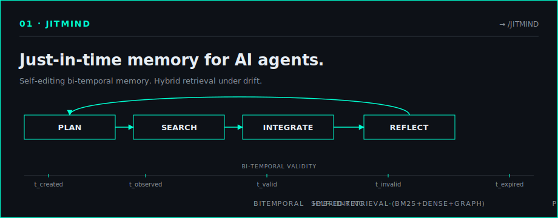
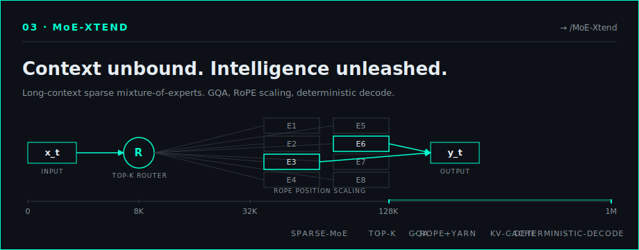
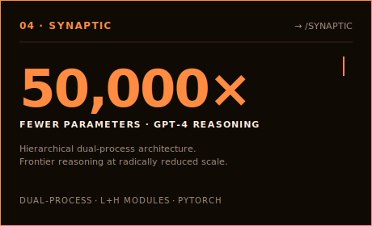
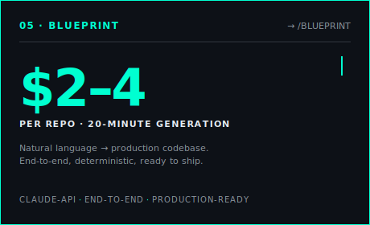
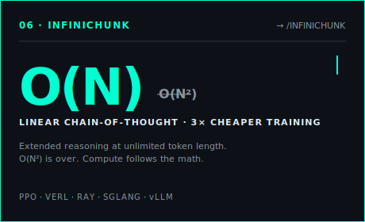
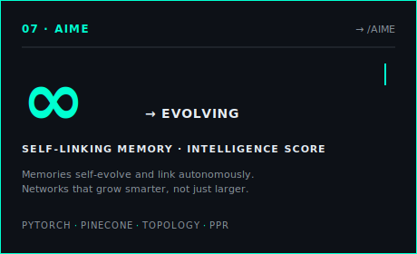

<!--
  divyamtalwar / divyamtalwar
  brutalist-minimal · pure black · single accent #00FFD1
  text speaks for itself.
-->

<picture>
  <source media="(prefers-color-scheme: dark)" srcset="assets/hero-v2.svg">
  
</picture>

<p align="left">
  
</p>

---

## ▸&nbsp;&nbsp;FEATURED&nbsp;SYSTEMS

<br/>

<sub>**FLAGSHIP · 01**&nbsp;&nbsp;━━&nbsp;&nbsp;<b>MEMORY SUBSTRATE</b></sub>

<p>
  
  
  
  
</p>

<a href="https://github.com/DivyamTalwar/JITMIND">
  
</a>

<sub>&nbsp;&nbsp;<b>WHY IT MATTERS</b> &nbsp;━&nbsp; Most agent memory rots silently. JITMIND makes correctness a runtime property, not a hope.</sub>

<br/><br/>

<sub>**FLAGSHIP · 02**&nbsp;&nbsp;━━&nbsp;&nbsp;<b>STRUCTURE RUNTIME</b></sub>

<p>
  
  
  
  
  
</p>

<a href="https://github.com/DivyamTalwar/STRUCTORIUM">
  
</a>

<sub>&nbsp;&nbsp;<b>WHY IT MATTERS</b> &nbsp;━&nbsp; Linters find issues. Structorium remembers them, ranks them, and blocks the next one before it ships.</sub>

<br/><br/>

<sub>**FLAGSHIP · 03**&nbsp;&nbsp;━━&nbsp;&nbsp;<b>COMPUTE RUNTIME</b></sub>

<p>
  
  
  
  
  
</p>

<a href="https://github.com/DivyamTalwar/MoE-Xtend">
  
</a>

<sub>&nbsp;&nbsp;<b>WHY IT MATTERS</b> &nbsp;━&nbsp; Long context isn't a config flag. It's an architecture decision. MoE-Xtend makes that decision honestly.</sub>

---

## ▸&nbsp;&nbsp;RESEARCH&nbsp;STACK

<sub><b>FOUR</b> &nbsp;━&nbsp; experimental systems pushing on the next set of primitives. Hand-built, single-author, public.</sub>

<br/><br/>

<table border="0" cellspacing="0" cellpadding="8" align="center">
<tr>
<td><a href="https://github.com/DivyamTalwar/SYNAPTIC"></a></td>
<td><a href="https://github.com/DivyamTalwar/BLUEPRINT"></a></td>
</tr>
<tr>
<td><a href="https://github.com/DivyamTalwar/INFINICHUNK"></a></td>
<td><a href="https://github.com/DivyamTalwar/AIME"></a></td>
</tr>
</table>

---

## ▸&nbsp;&nbsp;MORE&nbsp;SYSTEMS

<sub><b>FOUR MORE</b> &nbsp;━&nbsp; lower-profile but each load-bearing. None of these are demos.</sub>

<br/>

<table border="0" cellspacing="0" cellpadding="0">
<tr>
<td valign="top">
<sub><b>08 · MEMORIA</b>&nbsp;&nbsp;━━&nbsp;&nbsp;<a href="https://github.com/DivyamTalwar/MEMORIA"><code>/MEMORIA</code></a></sub>

> **Reflective memory engine for dialogue agents.**
> Hierarchical memory tiers fused with reflective compression and multi-modal embedding heads. Effectively-infinite recall, zero retrieval latency, 98% test coverage. The memory layer that makes assistants feel like they actually know you across sessions.

<sub>`PYTORCH 2.2+`&nbsp;&nbsp;·&nbsp;&nbsp;`CUDA 12.0+`&nbsp;&nbsp;·&nbsp;&nbsp;`MULTI-MODAL`&nbsp;&nbsp;·&nbsp;&nbsp;`98% COVERAGE`</sub>
</td>
</tr>
<tr><td><br/></td></tr>
<tr>
<td valign="top">
<sub><b>09 · CADENCE-AI</b>&nbsp;&nbsp;━━&nbsp;&nbsp;<a href="https://github.com/DivyamTalwar/Cadence-AI"><code>/Cadence-AI</code></a></sub>

> **Continuous vector generation over K-token patches.**
> Replaces token-by-token sampling with continuous heads (energy / diffusion / flow) operating on patches. Likelihood-free latent-space training scales semantic bandwidth past what autoregressive decoding can carry. Generation reframed as a continuous process, not a discrete one.

<sub>`AUTOENCODER`&nbsp;&nbsp;·&nbsp;&nbsp;`ENERGY-HEAD`&nbsp;&nbsp;·&nbsp;&nbsp;`DIFFUSION-HEAD`&nbsp;&nbsp;·&nbsp;&nbsp;`FLOW-HEAD`</sub>
</td>
</tr>
<tr><td><br/></td></tr>
<tr>
<td valign="top">
<sub><b>10 · SYNC</b>&nbsp;&nbsp;━━&nbsp;&nbsp;<a href="https://github.com/DivyamTalwar/SYNC"><code>/SYNC</code></a></sub>

> **Multi-agent orchestration with neural cognitive-gap detection.**
> Gateway → orchestrator → agent pod → LLM APIs, with a CKM (cognitive knowledge model) tracking every participant's mental state. An RL policy detects and closes cognitive gaps before consensus drifts. The conductor that keeps a pod of agents on the same page.

<sub>`CKM`&nbsp;&nbsp;·&nbsp;&nbsp;`RL-POLICY`&nbsp;&nbsp;·&nbsp;&nbsp;`MULTI-AGENT`&nbsp;&nbsp;·&nbsp;&nbsp;`CONSENSUS`</sub>
</td>
</tr>
<tr><td><br/></td></tr>
<tr>
<td valign="top">
<sub><b>11 · OUROBOROS</b>&nbsp;&nbsp;━━&nbsp;&nbsp;<a href="https://github.com/DivyamTalwar/OUROBOROS"><code>/OUROBOROS</code></a></sub>

> **Geometric residual networks with learned forget · erase · reflect.**
> Standard residuals accumulate signal indefinitely, drowning what matters. OUROBOROS prunes representational noise at the spectral level under learned control, keeping deep networks honest. Networks that forget on purpose.

<sub>`SPECTRAL-CONTROL`&nbsp;&nbsp;·&nbsp;&nbsp;`GEOMETRIC-RESNET`&nbsp;&nbsp;·&nbsp;&nbsp;`LEARNED-FORGET`</sub>
</td>
</tr>
</table>

---

## ▸&nbsp;&nbsp;COMPOSITION


```mermaid
%%{init: {'theme':'dark','themeVariables':{'background':'#0d1117','primaryColor':'#0d1117','primaryBorderColor':'#00FFD1','primaryTextColor':'#e6edf3','lineColor':'#30363d','secondaryColor':'#161b22','tertiaryColor':'#0d1117','clusterBkg':'#0d1117','clusterBorder':'#30363d','fontFamily':'JetBrains Mono, ui-monospace, monospace'}}}%%
flowchart LR
  subgraph MEMORY[ M E M O R Y ]
    direction TB
    JITMIND[JITMIND<br/><sub>bi-temporal</sub>]
    AIME[AIME<br/><sub>evolutionary</sub>]
  end
  subgraph REASONING[ R E A S O N I N G ]
    direction TB
    SYNAPTIC[SYNAPTIC<br/><sub>L + H modules</sub>]
    INFINICHUNK[INFINICHUNK<br/><sub>O&#40;N&#41; CoT</sub>]
    MOE[MoE-Xtend<br/><sub>long-context</sub>]
    CADENCE[Cadence-AI<br/><sub>latent-space</sub>]
  end
  subgraph RUNTIME[ R U N T I M E ]
    direction TB
    STRUCTORIUM[STRUCTORIUM<br/><sub>codebase OS</sub>]
    BLUEPRINT[BLUEPRINT<br/><sub>NL → repo</sub>]
    SYNC[SYNC<br/><sub>agent orch.</sub>]
    OUROBOROS[OUROBOROS<br/><sub>spectral control</sub>]
  end
  MEMORY ==> REASONING ==> RUNTIME
  STRUCTORIUM -.gates.-> BLUEPRINT
```

---

## ▸&nbsp;&nbsp;DOCTRINE

```
01 ━ memory is not a feature, it's a substrate
02 ━ structure is the cheapest reasoning
03 ━ compute scales when the math respects it
04 ━ ship primitives, not products
05 ━ own the runtime or rent the era
```

---

## ▸&nbsp;&nbsp;STACK

<table border="0" cellspacing="0" cellpadding="0">
<tr>
<td valign="middle" width="140"><sub><b>LANGUAGES</b></sub></td>
<td>
  &nbsp;&nbsp;&nbsp;
  &nbsp;&nbsp;&nbsp;
  &nbsp;&nbsp;&nbsp;
  &nbsp;&nbsp;&nbsp;
  
</td>
</tr>
<tr><td colspan="2"><br/></td></tr>
<tr>
<td valign="middle" width="140"><sub><b>ML&nbsp;·&nbsp;AI</b></sub></td>
<td>
  &nbsp;&nbsp;&nbsp;
  &nbsp;&nbsp;&nbsp;
  &nbsp;&nbsp;&nbsp;
  &nbsp;&nbsp;&nbsp;
  &nbsp;&nbsp;&nbsp;
  
</td>
</tr>
<tr><td colspan="2"><br/></td></tr>
<tr>
<td valign="middle" width="140"><sub><b>RUNTIME&nbsp;·&nbsp;SERVE</b></sub></td>
<td>
  &nbsp;&nbsp;&nbsp;
  &nbsp;&nbsp;&nbsp;
  &nbsp;&nbsp;&nbsp;
  &nbsp;&nbsp;&nbsp;
  &nbsp;&nbsp;&nbsp;
  
</td>
</tr>
<tr><td colspan="2"><br/></td></tr>
<tr>
<td valign="middle" width="140"><sub><b>INFRA&nbsp;·&nbsp;DATA</b></sub></td>
<td>
  &nbsp;&nbsp;&nbsp;
  &nbsp;&nbsp;&nbsp;
  &nbsp;&nbsp;&nbsp;
  &nbsp;&nbsp;&nbsp;
  &nbsp;&nbsp;&nbsp;
  &nbsp;&nbsp;&nbsp;
  
</td>
</tr>
</table>

---

## ▸&nbsp;&nbsp;TELEMETRY

<p align="left">
  
  
  
</p>

<br/>

<picture>
  <source media="(prefers-color-scheme: dark)" srcset="https://raw.githubusercontent.com/DivyamTalwar/DivyamTalwar/output/github-contribution-grid-snake-dark.svg">
  <source media="(prefers-color-scheme: light)" srcset="https://raw.githubusercontent.com/DivyamTalwar/DivyamTalwar/output/github-contribution-grid-snake.svg">
  
</picture>

---

<p align="right">
  <sub>
    <a href="https://github.com/DivyamTalwar"><b>github</b></a>
    &nbsp;·&nbsp;
    <a href="https://x.com/divyamtalwar"><b>x</b></a>
  </sub>
</p>
